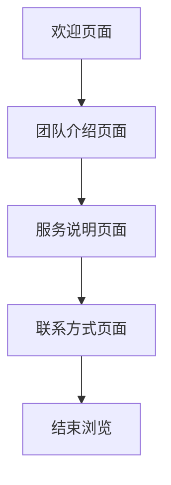

## 1. 产品概述
这是一个移动端优先的团队展示页面，用于锦囊妙计AI技术交付团队的介绍和展示。页面将以赛博朋克风格的深色设计配合霓虹色彩，通过渐现文字效果和背景音乐营造沉浸式体验。

目标用户：移动端用户，主要是团队成员、潜在客户和合作伙伴。

## 2. 核心功能

### 2.1 用户角色
| 角色 | 访问方式 | 核心权限 |
|------|----------|----------|
| 访客用户 | 直接访问 | 浏览团队介绍、成员信息、联系方式 |

### 2.2 功能模块
我们的团队展示页面包含以下核心页面：
1. **欢迎页面**：团队欢迎文案的渐现展示
2. **团队介绍页面**：团队核心成员展示和角色介绍
3. **服务说明页面**：Q&A内容和服务流程说明
4. **联系方式页面**：紧急联系和日常答疑时间

### 2.3 页面详情
| 页面名称 | 模块名称 | 功能描述 |
|-----------|-------------|---------------------|
| 欢迎页面 | 文案展示区域 | 渐现显示欢迎文案，支持手动翻页到下一段 |
| 欢迎页面 | 背景音乐控制 | 自动播放轻音乐，提供静音/播放切换按钮 |
| 团队介绍页面 | 成员卡片展示 | 展示书棋、贵哥、楚玲、何聪、飞宇、周惠等核心成员的头像、姓名和职责 |
| 团队介绍页面 | 视觉背景 | 深色渐变背景配合霓虹色彩元素 |
| 服务说明页面 | Q&A模块 | 展示群功能、问题解决流程、课程安排等6个核心问答 |
| 服务说明页面 | 30天成长计划 | 展示每日陪跑计划的时间安排和内容形式 |
| 联系方式页面 | 紧急联系 | 显示贵哥和楚玲的电话号码 |
| 联系方式页面 | 答疑时间 | 展示每日9:00-22:00的答疑服务时间 |

## 3. 核心流程
用户访问流程：
1. 用户通过手机浏览器访问页面
2. 欢迎页面自动加载，文案开始渐现效果
3. 用户可手动滑动或点击切换到团队介绍
4. 浏览团队成员信息后，可继续查看服务说明
5. 最后查看联系方式页面

## 4. 用户界面设计

### 4.1 设计风格
- **主色调**：深蓝色到紫色渐变背景 (#1a1a2e 到 #16213e)
- **强调色**：青色 (#36e2ff)、洋红色 (#ff4fc3)、亮紫色
- **按钮样式**：圆角矩形，霓虹发光效果
- **字体**：无衬线字体，标题粗体，正文中等粗细
- **布局风格**：卡片式布局，顶部导航，中央内容区域
- **图标风格**：简约线条图标，配合霓虹色彩

### 4.2 页面设计概览
| 页面名称 | 模块名称 | UI元素 |
|-----------|-------------|-------------|
| 欢迎页面 | 文案展示区域 | 全屏深色背景，白色/青色文字，逐行渐现动画效果，底部有进度指示器 |
| 团队介绍页面 | 成员卡片展示 | 网格布局成员卡片，每张卡片包含头像、姓名(青色)、职责(白色)，卡片有霓虹边框 |
| 服务说明页面 | Q&A模块 | 手风琴式展开收起，问题标题青色，回答内容白色，配合图标标识 |
| 联系方式页面 | 紧急联系 | 大号电话按钮，青色背景白色文字，点击可直接拨打电话 |

### 4.3 响应式设计
- **移动端优先**：针对手机屏幕优化，支持iOS和Android
- **触摸交互优化**：按钮大小适合手指点击，滑动切换页面
- **适配多种屏幕**：从小屏手机到大屏手机都能良好显示

### 4.4 动效设计
- **文字渐现**：每段文字从上到下逐行显示，营造仪式感
- **页面切换**：平滑的滑动过渡效果
- **按钮交互**：点击时的霓虹闪烁反馈
- **背景音乐**：轻柔的电子音乐，音量适中，可控制