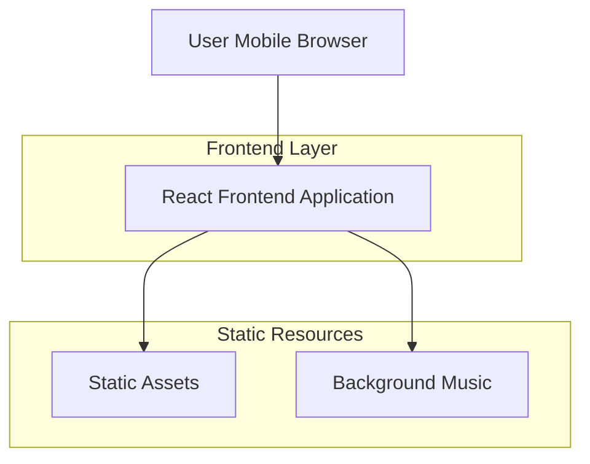

## 1. 架构设计



## 2. 技术描述
- **前端**: React@18 + tailwindcss@3 + vite
- **初始化工具**: vite-init
- **后端**: 无（纯静态页面）
- **音频处理**: HTML5 Audio API
- **动画库**: Framer Motion 或 CSS3 Animation

## 3. 路由定义
| 路由 | 用途 |
|-------|---------|
| / | 欢迎页面，团队欢迎文案渐现展示 |
| /team | 团队介绍页面，展示核心成员信息 |
| /services | 服务说明页面，Q&A和服务流程 |
| /contact | 联系方式页面，紧急联系和答疑时间 |

## 4. 核心组件结构

### 4.1 页面组件
```typescript
// 欢迎页面组件
interface WelcomePageProps {
  onNext: () => void;
  onMusicToggle: () => void;
  isMusicPlaying: boolean;
}

// 团队成员卡片组件
interface TeamMemberCardProps {
  name: string;
  role: string;
  avatar?: string;
  color: string;
}

// Q&A展开组件
interface QAItemProps {
  question: string;
  answer: string;
  icon: string;
}
```

### 4.2 动画配置
```typescript
// 文字渐现动画
const fadeInAnimation = {
  initial: { opacity: 0, y: 20 },
  animate: { opacity: 1, y: 0 },
  transition: { duration: 0.8, ease: "easeOut" }
};

// 卡片悬浮效果
const cardHoverAnimation = {
  scale: 1.05,
  boxShadow: "0 0 25px rgba(54, 226, 255, 0.5)"
};
```

## 5. 静态资源配置

### 5.1 图片资源
- 团队成员头像（如提供）
- 背景装饰元素（霓虹线条、科技感图标）
- 品牌Logo和标识

### 5.2 音频资源
- 背景音乐文件（MP3格式，建议时长3-5分钟，循环播放）
- 音频控制图标（播放/暂停）

### 5.3 字体资源
- 中文字体：思源黑体或系统默认无衬线字体
- 英文字体：Roboto 或系统默认无衬线字体

## 6. 性能优化

### 6.1 代码分割
- 按页面进行代码分割，减少初始加载时间
- 图片懒加载，优先显示关键内容

### 6.2 缓存策略
- 静态资源设置长期缓存
- 音频文件预加载，但延迟播放

### 6.3 移动端优化
- 触摸事件优化，避免300ms延迟
- 图片压缩和响应式图片
- 减少重绘和回流，提升滚动性能